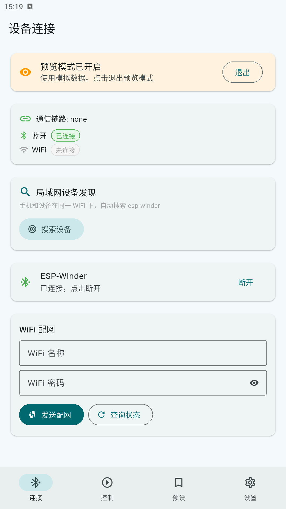
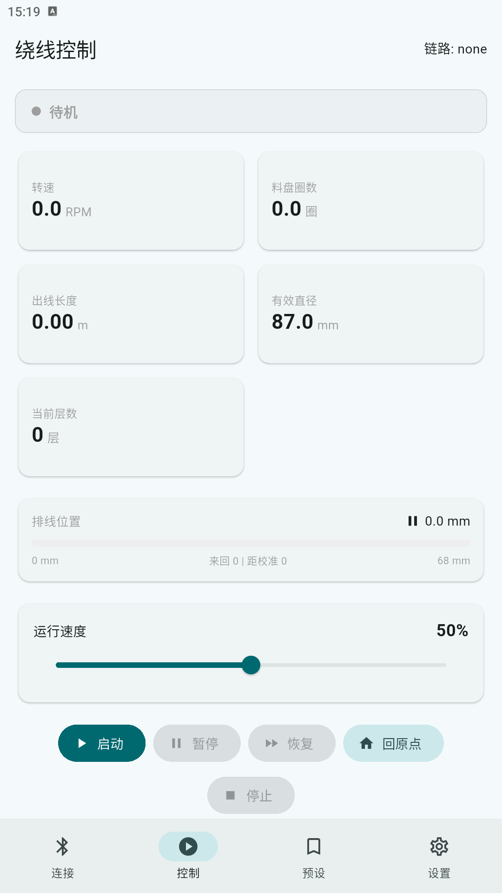
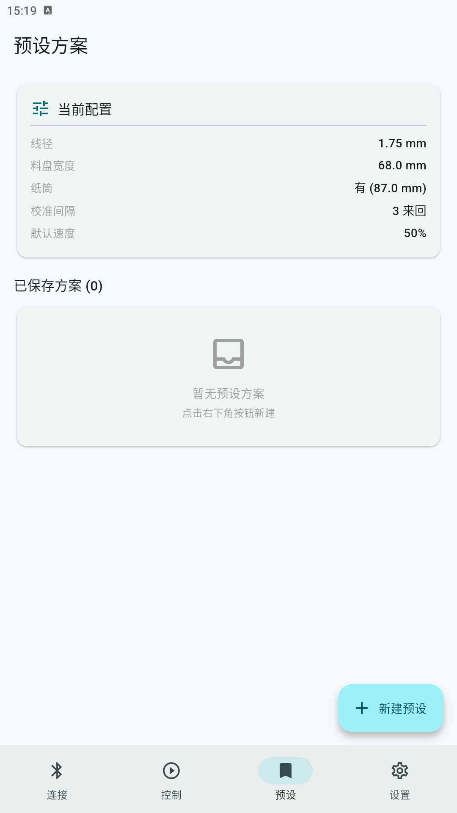
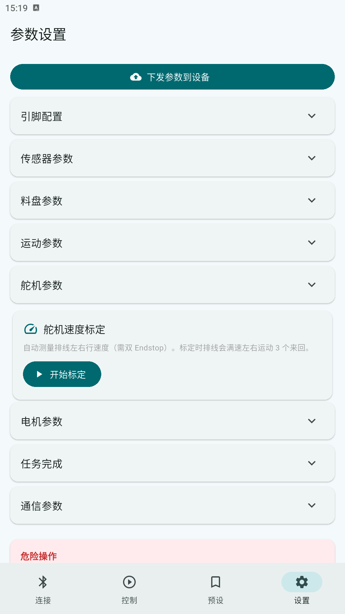

<div align="center">

# iWinder

### 3D 打印智能绕线器 · 手机 APP 无线控制 · 开源

ESP32 + 舵机丝杆排线 + 直流电机收线，把散装线材整齐绕到任何料盘上。

**不只绕耗材——电线、绳线、织带，通通能绕。**


</div>

---
QQ 交流群：1103884695

## ✨ 项目亮点

- 📱 **手机 APP 无线控制** — WiFi 连接，实时监控转速/长度/排线位置，不用守在机器旁边
- 🧵 **自适应排线** — 排线速度根据料盘实际转速自动同步，每圈移动一个线径，紧密排列无间隙
- 🎛️ **全程可调** — 线径、料盘尺寸、速度、排线范围全部 APP 里改，支持保存 10 组预设方案
- 🔧 **几乎兼容所有料盘** — 拓竹、eSUN、随便什么牌子，尺寸不合适随时调参数
- 💰 **成本低** — 全套约 ¥56+（不含打印件），手摇版最省
- 🔓 **完全开源** — 硬件 + 固件 + APP + 3D 模型，CC BY-NC 4.0

## 🎯 能绕什么？

| 线材类型 | 说明 |
|---------|------|
| 3D 打印耗材（PLA/PETG/TPU...） | 1.75mm / 2.85mm / 3mm，默认拓竹 1kg 料盘 |
| 电线 / 线束 | 绕到线盘上，排线整齐不乱 |
| 钓鱼线 / 细绳 | 换个料盘就能绕 |
| 织带 / 扁平带材 | 调整排线间距即可 |

> 只要料盘装得上去、参数调得好，什么都能绕。

---

## 📸 效果展示

### 整机外观

<div align="center">


</div>

### APP 界面

<div align="center">
<table>
<tr>
<td align="center"><b>设备连接</b></td>
<td align="center"><b>控制面板</b></td>
</tr>
<tr>
<td align="center"><br><sub>WiFi 配网 / 局域网搜索 / 直连 IP</sub></td>
<td align="center"><br><sub>启停控制 / 实时调速 / 运行监控</sub></td>
</tr>
</table>
</div>

<div align="center">
<table>
<tr>
<td align="center"><b>参数预设</b></td>
<td align="center"><b>设置页面</b></td>
</tr>
<tr>
<td align="center"><br><sub>料盘参数管理 / 一键切换方案</sub></td>
<td align="center"><br><sub>引脚/传感器/舵机/电机全部可调</sub></td>
</tr>
</table>
</div>

### 运行演示

> 🎬 运行 GIF 待补充（绕线过程 + APP 实时数据）

---

## 🏗️ 组装

> 详细组装视频可参考原作者 [废改实验室](https://makerworld.com.cn/zh/models/2379707-san-liao-rao-xian-qi-shou-yao-dian-dong) 的教程（电机部分）。

### 版本选择

本项目提供三个版本，核心排线机构相同，区别在收线驱动方式：

| 版本 | 成本（不含打印件） | 适合人群 | 特点 |
|------|------|---------|------|
| **手摇/电钻** | ~¥56 | 预算有限 | 手摇或电钻驱动，最经济 |
| **单电机** | ~¥80 | 推荐首选 | 电机自动收线，解放双手 |
| **双电机** | ~¥98 | 追求扭矩 | 双电机驱动，更强力 |

> 详细 BOM 见 [`BOM/`](BOM/) 目录（含拼多多链接和价格）。

### 硬件清单

| 部件 | 规格 | 说明 |
|------|------|------|
| 主控板 | ESP32-DevKitC（普通版） | |
| 收线盘电机 | 直流减速电机 6V 40RPM | 单向收线（单/双电机版） |
| 电机驱动 | IRLB8721 逻辑电平 MOS 管 + 1N5822 续流二极管 | PWM 调速（⚠️ 不可用 IRF520，其栅极需 10V，ESP32 3.3V 无法完全导通） |
| 排线编码器（可选，强烈推荐） | AS5600 磁编码器模块 + Φ6 径向磁铁 | 直测丝杆，闭环位置精度 ±0.1mm 级 |
| 排线舵机 | MG946R 360° 连续旋转（首选）/ 鑫辉 18KG（备选） | 驱动丝杆排线 |
| 丝杆 | T8 四头丝杆 + 螺母（导程 22mm） | |
| 霍尔传感器 | KY-003（A3144）× 1 | 料盘计圈 |
| 磁铁 | N35 Φ6×2mm × 8 | 贴在料盘上配合霍尔 |
| 限位开关 | 摆杆式 Endstop × 2 | 左原点 + 右限位 |
| 轴承 | 608ZZ × 8 | |
| 电源 | 多路降压模块（3.3V/5V/12V） | 鹿小班 DCP3512 或等效 |

<details>
<summary>📌 舵机说明（点击展开）</summary>

- **首选：MG946R 360° 连续旋转舵机**（泰尔科技，约 ¥12.2）
  - 需额外打印「模型/配置/mg946 改双轴.3mf」改装件
  - 参考项目：[MG996R 双轴舵机适配器](https://makerworld.com.cn/zh/models/538013) by LaphaeL
- **备选：鑫辉 18KG 360° 连续旋转舵机**（约 ¥31）
  - 自带金属舵盘，无需改装件
  - 支持 7.4V，扭矩更大
- ⚠️ 两个都是 **360° 连续旋转舵机**，不是普通 180° 位置舵机

</details>

### 接线

**ESP32 信号线**

| ESP32 引脚 | 连接 |
|-----------|------|
| GPIO 4 | 电机 PWM → 150Ω 电阻 → IRLB8721 栅极（G），栅极与源极（S）间接 10kΩ 下拉电阻 |
| GPIO 5 | 舵机 PWM 信号线 |
| GPIO 32 | Endstop 左（原点校准）信号 |
| GPIO 14 | Endstop 右（硬限位保护）信号 |
| GPIO 27 | 霍尔传感器信号 |
| GPIO 21 | AS5600 编码器 SDA（可选） |
| GPIO 22 | AS5600 编码器 SCL（可选） |
| GPIO 2 | 板载 LED（状态指示，无需外接） |

**供电**

| 电源模块输出 | 连接 |
|-------------|------|
| 3.3V | ESP32 3V3 脚、霍尔传感器 VCC、Endstop 信号公共端、AS5600 VCC |
| 5V | 舵机 VCC |
| 12V | 电机正极；电机两端并联 1N5822 续流二极管（负极朝 12V 端）；电机负极接 IRLB8721 漏极（D），源极（S）接 GND |
| GND | 所有模块共地 |

> ⚠️ ESP32 的 GND 必须与电机/舵机电源的 GND **共地**，否则 PWM 信号不稳定。
> ⚠️ **电机 PWM 线（GPIO4）不要与舵机信号线（GPIO5）并排/捆扎走线**——PWM 开关噪声
> 会耦合进舵机信号，导致排线在"停止"状态下仍缓慢漂移。固件已将电机 PWM 提到 20kHz
> 缓解，但布线时仍应分开；更稳妥可在舵机信号线上加 RC 滤波（串 1kΩ + 对地 100nF）。
> ⚠️ **AS5600 磁铁装丝杆轴端**，轴向对准芯片中心、间隙 0.5~2mm、尽量同心——
> 磁铁偏心是这类编码器最大的误差源。装好后先跑 `test_encoder` 验证无漂移。
> ⚠️ **Endstop 安装**：以"刚刚触发"状态为基准（摆杆压过咔哒点再多 0.3~0.5mm 固定），
> 剩余超程作为寻原位停止冲量的缓冲。两个限位触发点之间的真实距离用 `test_encoder`
> 测出（小结行会打印），填入「限位间距」参数——限位绝对装在哪不重要，重复性才重要。
> 引脚全部可在 `esp32/include/config.h` 中修改，也可通过 APP 运行时调整。

### 3D 打印

`模型/` 目录下提供所有打印件。推荐使用 Bambu Studio 切片，**PETG**（所有模型均在 PETG 下测试通过），PLA 也可以。

---

## 🚀 使用指南

### 第一步：烧录固件

**安装 PlatformIO**（VS Code 插件或命令行均可）

```bash
pip install platformio
```

**烧录**

1. USB 连接 ESP32 到电脑
2. 编译并烧录：

```bash
cd esp32
pio run -e esp32 -t upload
```

3. 烧录完成后打开串口确认启动成功：

```bash
pio device monitor
```

> 💡 可单独测试硬件模块：`pio run -e test_motor -t upload`（可选：`test_led`、`test_servo`、`test_hall`、`test_endstop`、`test_encoder`、`test_wifi`）
>
> `test_encoder` 会驱动排线满速来回扫描（限位自动换向），打印编码器角度/圈数/位置/速度，
> 并在每趟小结「限位间圈数 × 导程」，用于验证编码器装配和测量限位间距。

### 第二步：安装 APP

**最简方式（推荐）**：无需安装任何东西——烧录固件后，手机/电脑浏览器直接访问设备：

- 热点模式：连上 WiFi **ESP-Winder** 后打开 `http://192.168.4.1`
- 家庭 WiFi 模式：iOS/macOS 浏览器直接打开 `http://iwinder.local`（mDNS 自动解析）；
  其他设备可从串口日志或 App「搜索设备」获取 IP 后访问

Web 界面支持控制（启停/调速/手动模式）、实时状态、参数修改和舵机标定，iOS/安卓/电脑通用。
只要设备连入了局域网（家庭 WiFi）或开着热点（ESP-Winder），同一网络内的任何浏览器
都可以访问，无需安装、无需账号；可多端同时在线，与安卓 App 互不干扰。

> ⚠️ 家庭 WiFi 模式要求访问设备与 ESP32 连**同一个路由器**，且路由器关闭了
> 「AP 隔离 / 客户端隔离 / 访客网络隔离」——开着隔离的表现是能解析出
> `iwinder.local` 但页面打不开。部分路由器对 IoT 设备默认隔离，需要在管理界面放行。
>
> 💡 设备端负载：Web/APP 在线时 CPU 占用 <15%，控制循环为闭环设计（编码器实测位置 +
> 硬件 PWM），偶发的网络处理延迟（毫秒级）不影响绕线精度，多端同时连接也无需担心。

也可以使用功能更完整的安卓 APP：

从 [Releases](../../releases) 下载 `app-release.apk`，传到手机安装。

<details>
<summary>或自行编译（需要 Flutter 环境）</summary>

```bash
cd app
flutter pub get
flutter build apk --release
# 产物：build/app/outputs/flutter-apk/app-release.apk
```

</details>

### 第三步：连接设备

ESP32 上电后会启动 **WiFi 热点（ESP-Winder）**。

1. 手机 WiFi 设置里连接热点 **ESP-Winder**
2. 打开 APP → IP 填 `192.168.4.1`，端口 `8080` → 连接
3. 在「WiFi 配网」输入家庭 WiFi 密码 → 发送配网
4. 手机切回家庭 WiFi，以后用「搜索设备」自动发现连接

### 第四步：开始绕线

1. **选驱动模式**：设置页「驱动模式」→ 电动（电机驱动）或 手动（手摇驱动，电机不输出）
2. **选预设**：默认拓竹 1kg，可自定义线径/料盘尺寸
3. **标定**（设置页）：
   - 装了 AS5600：切「AS5600 编码器闭环」（齿比填 1.0），点「舵机速度标定」——
     自动测量满速/步进速度、编码器每圈位移并写入 NVS
   - 未装编码器：用默认「舵机开环估算」，必须先跑「舵机速度标定」才能启动
4. **启动**：电动模式拖速度滑块调速启动；手动模式直接启动后手摇，排线自动跟随转速
5. **运行监控**：APP 实时显示转速、圈数、长度、排线位置
6. **停止**：点「停止」，排线自动回原点归位

**手动模式行为**：手摇越快排线越快，停手约 1 秒排线暂停；停转约 2 秒（且来回数达标）
自动触发一次限位校准并回到原位置继续。电动模式带缠料保护（电机运转但料盘停转 4 秒报错）。

---

## ⚙️ 参数调校

首次使用在 APP 设置页面配置/标定：

| 参数 | 说明 |
|------|------|
| 驱动模式 | 电动（电机）/ 手动（手摇），行为差异见上 |
| 位置反馈 | 舵机开环估算 / AS5600 编码器闭环（装编码器后强烈建议开启） |
| 排线速度标定 | 自动测量满速 3 个来回 + 步进速度 1 个来回；编码器模式下还会标定每圈位移 |
| 限位间距 | 左右限位**触发点**之间的真实距离（默认 59mm = 本机实测 58.8）。⚠️ 用 `test_encoder` 测量时注意「右停稳→左触发」含柔性回弹（偏大约 5mm），最准的方法是：绕线/定位日志中右锚定坐标 − 左触发坐标 |
| 霍尔去抖 | 默认 25000us（滤除电机 PWM 耦合噪声），真实转速超 300RPM 才需调小 |
| 料盘参数 | 外径、宽度（拓竹料盘宽 60mm，默认已填）、芯轴直径（有/无纸筒可切换）——只影响长度/层数计算 |
| 绕线范围 | 左起始位置（默认 2mm，与料盘左法兰对齐）、右终止位置（默认 56mm，距右限位留 2mm 余量）——绕线宽度 = 右终止 − 左起始（⚠️ 不是料盘宽度；左起始取决于料盘相对排线机构的安装位置，以导向件对齐料盘左法兰为准） |
| 校准间隔 | 电动: 每几个来回校准一次；手动: 停转触发校准前至少需要的来回数 |
| 缠料保护 | 电动模式电机运转但料盘 0 转速持续 4 秒自动停机报错 |

所有参数支持保存为预设方案（最多 10 组），一键切换。ESP32 断电后参数保存在 NVS 中不会丢失。
⚠️ 固件升级若改动 DeviceConfig 结构体，首次启动会重置参数（WiFi 凭据保留），需重新配置下发。

---

## 📁 项目结构

```
├── app/            # Flutter 手机 APP（Android）
├── esp32/          # ESP32 固件（PlatformIO + Arduino）
├── 模型/           # 3D 打印模型文件（.3mf / .step）
├── BOM/            # 硬件采购清单（三个版本）
└── 设定/           # 开发文档
    ├── 描述.md     # 完整开发规范（硬件/协议/APP/配置）
    └── 重构方案.md # WiFi/LEDC 问题修复记录
```

---

## 🙏 鸣谢

- [废改实验室](https://makerworld.com.cn/zh/models/2379707-san-liao-rao-xian-qi-shou-yao-dian-dong) — 原始散料绕线器设计
- [LaphaeL](https://makerworld.com.cn/zh/models/538013) — MG996R 双轴舵机适配器

## 可选配件

- [耗材旋转支架](https://makerworld.com.cn/zh/models/1705115-hao-cai-xuan-zhuan-zhi-jia) — 放散料用，省料

---

## License

CC BY-NC 4.0（署名-非商业性使用 4.0 国际）

本项目硬件设计（3D 模型）和软件代码均可自由使用、修改和分享，但**不得用于商业目的**，使用时需注明出处。详见 [LICENSE](LICENSE)。

---

<div align="center">

制作不易，如果这个项目对你有帮助，欢迎 ⭐ Star 支持一下（当然如果愿意助力我买个 fusion 的话我也是不介意的😄）！


</div>
